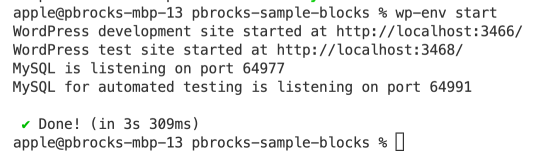
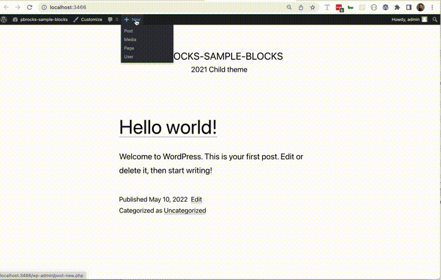

# pbrocks-sample-blocks

Some blocks developed by pbrocks.

 * Tabs Block - originally done for <b>Gutenberg Examples</b> plugin
 * Image Carousel - proof of concept treatment of Swiper JS

## .wp-env

If you have Docker installed, you could use wp-env package to load a WordPress development environment with this plugin automatically activated.

### To setup this repo

#### Install wp-env globally

In a terminal window, run:

```sh
npm i -g @wordpress/env
```

#### Clone this repository

In a terminal window, run:

```sh
git clone git@github.com:pbrocks/pbrocks-sample-blocks.git
```

if you have your SSH keys set up. If not, run:

```sh
git clone https://github.com/pbrocks/pbrocks-sample-blocks.git
```

#### Change directory and run wp-env

In your terminal window, run:

```sh
cd pbrocks-sample-blocks
wp-env start
```

You should then see that a development site has been configured for you on localhost port 3466



## Tabs Block


